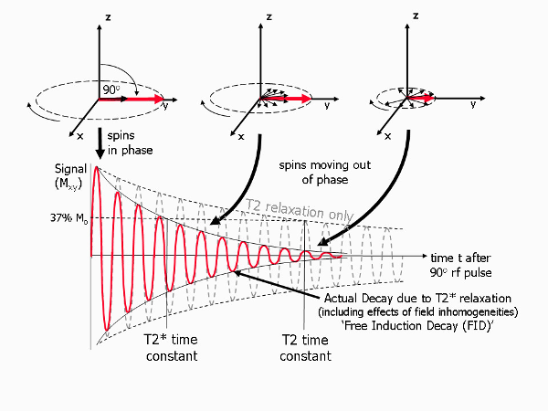

name: centred
layout: true
class: center, middle, inverse
---
# fMRI Paradigms
---
## Who Am I

GAVIN COOPER

Research Academic

Centre for Brain and Mental Health Research

Faculty of Health

W: https://www.newcastle.edu.au/profile/gavin-cooper

---
## Outline
### BOLD fMRI
### Limitations and Considerations
### fMRI Paradigms
### Complimentary sequences and clinical outcomes
---
layout: true
name: columns
class: inverse, middle
---
.left-column[
## BOLD fMRI
]
.right-column[
### The physics

T2\* is used in functional MRI. It is a measure of the component that does not rephase after a 180 degree RF pulse.

.center[]
.imlabel[T2 & T2\* relaxation processes. Source: [jcmr-online](http://www.jcmr-online.com/content/12/1/71/figure/F4)]
]
???
* First RF pulse puts all proton spins in phase.
* As they de-phase (relax) they are hit with a second RF pulse at 180 degrees.
* This flips the fields over and causes them to begin to re-phase.
* The portion that does not re-phase due to microscopic distortions of the magnetic field creates our T2\* signal
---
.left-column[
## BOLD fMRI
]
.right-column[
### The biology

* One source of these microscopic distortions is blood, which gives gives us BOLD fMRI.
* BOLD is due to oxygen attached to hemoglobin.
* The brain efficently delivers oxygenated blood to parts of the brain with a higher energy budget (ie activity), which results in blood vessels increasing in size.

.center[]
.imlabel[A view of the main arteries from below the brain]
]

???

* Oxygenated and deoxygenated hemoglobin have different magnetic properties.
* So we have:
  * Activity
  * Increased blood vessel size
  * More deoxyhemoglobin
  * Change in magnetic local properties as measured by T2\*
  * Image
---
template: centred
### Sample Image
.center[]
.imlabel[A label for the image]
---
template: centred
## Final Discussion

.uncentre[
Proin sit amet erat iaculis, lobortis quam sit amet, tempor tellus. Integer nec rhoncus nulla. Duis dignissim dignissim justo, et sodales erat consectetur eget. Mauris augue neque, porttitor et condimentum a, interdum vitae sem. Proin laoreet dui eu placerat efficitur. In lacinia laoreet augue. Nunc vulputate nulla eget malesuada vulputate. Cum sociis natoque penatibus et magnis dis parturient montes, nascetur ridiculus mus. Curabitur maximus, neque in efficitur placerat, velit nibh vestibulum nunc, vitae laoreet augue augue ut nibh. Quisque et justo nec magna finibus cursus. Donec fringilla, nisl a faucibus fringilla, eros nisi lobortis massa, eu molestie neque lacus vel risus. Integer elementum massa eget porttitor pulvinar. Nulla tempor leo sed imperdiet egestas. Proin molestie ipsum et tellus facilisis, suscipit ultrices nulla ornare. Praesent dapibus lectus dolor, condimentum vulputate diam elementum a. Mauris porta et mi vitae dictum.

Integer fringilla efficitur ex:

* Fusce sit amet eros non ante finibus commodo. Sed elementum faucibus dui, ut ultrices sem commodo ut. Quisque id lacus viverra libero molestie malesuada ac at tellus. Nam sed ultrices nisl, sed varius justo. Duis sollicitudin, nisi non dignissim efficitur, dui velit egestas augue, eget euismod lectus nulla ac leo. In feugiat leo non purus interdum blandit sed non leo. Nullam congue rutrum sem, eget euismod metus vulputate a. Nam vitae pellentesque neque. Sed ultrices mauris neque, quis luctus nunc vehicula vitae. In posuere nec nibh a lobortis. Donec eu sollicitudin sem. Etiam eleifend, nunc eu iaculis finibus, ex eros faucibus purus, sed tempus leo sapien sed elit.

* Maecenas ipsum mauris, semper feugiat libero et, tristique fringilla erat. Maecenas porta mi ut mi porta, eget sollicitudin enim porttitor. Mauris viverra posuere est, mollis egestas mauris tincidunt eget. Mauris aliquam bibendum libero ac sodales. Nullam sit amet sem vitae purus cursus ornare id eu ex. Morbi ut dapibus orci. Vestibulum ligula est, rutrum vestibulum risus et, varius facilisis eros. Donec et nunc vitae libero feugiat sodales. Suspendisse eu placerat nulla, eu lacinia metus. Cras convallis erat elit, ac egestas nulla pellentesque eu. Ut at mi consectetur, hendrerit orci sit amet, scelerisque ligula.

* Nam tincidunt, arcu vel tristique pulvinar, mi eros imperdiet neque, ut elementum ante tortor sed neque. Nulla facilisis facilisis lorem, id scelerisque dolor lacinia quis. Duis eget purus placerat, posuere mauris vel, viverra quam. Curabitur vel diam congue, iaculis mi commodo, pretium purus. Suspendisse mattis ipsum justo, nec pharetra mauris facilisis vitae. Nam pulvinar, est quis scelerisque blandit, lacus turpis fringilla massa, quis aliquet metus nibh sit amet enim. Vestibulum posuere nibh quam, eget tempor dolor bibendum quis.
]
---
template: centred
## Thank You

.uncentre[
You can find me @ ...
]
