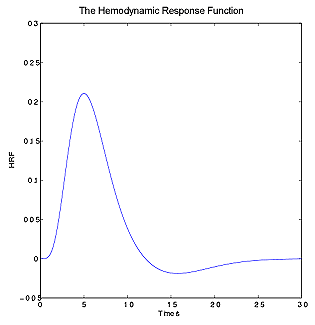
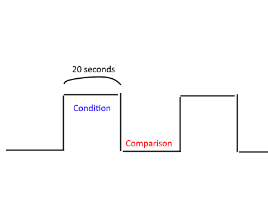

name: centred
layout: true
class: center, middle, inverse
---
# fMRI Paradigms
---
## Who Am I

### GAVIN COOPER

Research Academic with the CBMHR at UoN

Been working with MRI data for > 10 years

https://www.newcastle.edu.au/profile/gavin-cooper

---
## Outline
### BOLD fMRI
### Limitations and Considerations
### fMRI Paradigms
### Complimentary sequences and clinical uses
---
layout: true
name: columns
class: inverse, middle
---
.left-column[
## BOLD fMRI
]
.right-column[
### The physics

T2\* is used in functional MRI. It is a measure of the component that does not re-phase after a 180 degree RF pulse.

.center[]
.center[.imlabel[T2 & T2\* relaxation processes. Source: [jcmr-online](http://www.jcmr-online.com/content/12/1/71/figure/F4)]]
]
???
* First RF pulse puts all proton spins in phase.
* As they de-phase (relax) they are hit with a second RF pulse at 180 degrees.
* This flips the fields over and causes them to begin to re-phase.
* The portion that does not re-phase due to microscopic distortions of the magnetic field creates our T2\* signal
---
.left-column[
## BOLD fMRI
]
.right-column[
### The biology

* One source of these microscopic distortions is blood, which gives gives us BOLD fMRI.
* BOLD is due to oxygen attached to hemoglobin.
* The brain efficiently delivers oxygenated blood to parts of the brain with a higher energy budget (i.e. activity), which results in blood vessels increasing in size.

.center[]
.center[.imlabel[A view of the main arteries from below the brain]]
]

???

* Oxygenated and de-oxygenated hemoglobin have different magnetic properties.
* So we have:
  * Activity
  * Increased blood vessel size
  * More deoxyhemoglobin
  * Change in magnetic local properties as measured by T2\*
  * Image
---
.left-column[
## BOLD fMRI
]
.right-column[
### The HRF

* The transforms that take us from brain activity to an image create an approximately linear system.
* If we know the Impulse Response Function for a linear system it allows us to calculate input to the system from a measurement.
* In BOLD fMRI this IRF is called the hemodynamic response function (HRF).

.center[]
.center[.imlabel[The canonical HRF]]
]
---
.left-column[
## BOLD fMRI
## Limitations and Considerations
]
.right-column[
### Limitations (the HRF)

* Different people can have different HRF's.

* Different populations can have different HRF's.

* Different regions in the brain can have different HRF's

* Some drugs can affect the HRF

* Hormonal state can affect the HRF

* ...
]
???
* Have to be careful with claims about an individuals person

* Have to do everything possible to match populations with appropriate controls.

* Differences are often subtle.

* Control your samples as much as possible.
---
.left-column[
## BOLD fMRI
## Limitations and Considerations
]
.right-column[
### Limitations (the BOLD response)

* BOLD is a slow averaged out response compared to neuron spikes. 3-4 seconds of time resolution.

* A point of neural activity in the brain evokes a blood flow response about 3mm wide.

* These are fundamental limitations of BOLD fMRI and are biological in nature rather than scanner limitations.

]
???
* 3-4 second time resolution
* ~3mm spatial resolution

---
.left-column[
## BOLD fMRI
## Limitations and Considerations
]
.right-column[
### Other considerations

* The relationship between stimulation of the participant and brain activity is non-linear

* Many sources of noise:
  * Head motion
  * Cardio-Pulmanary Fluctuations
  * Distortion due to ferro-magnetic substance presence
  * Susceptibility artifact

* fMRI scanner paradigms are noisy and care needs to be taken with auditory based studies.

* Hardware for MR room needs to be specially designed and is often expensive.

* Each volume is a series of slices acquired at different times - need to control for that in analysis.

* BOLD is an **indirect** measure and has no direct interpretation or units.

* BOLD is also an integrated measure, so it is only detectable if there is a bulk change in neural activity.

]
???
* Twice as many words does not -> twice as much brain activation

* Susceptibility artifact - distortion due to air/fluid/flesh boundaries (sinuses, ear canals - important for auditory lobes)

* Visual stimulus delivery, audio delivery, subject response collection, ...

* BOLD is a relative signal and must be compared between states.

* Bulk change as opposed to a change in pattern of firing.

---
.left-column[
## BOLD fMRI
## Limitations and Considerations
## fMRI Paradigms
]
.right-column[
### Types of Neuroimaging Studies

#### Forward Inference

* The brain area that corresponds to an isolated behaviour

* Isolate the behaviour by subtracting conditions.

* Key problem is that all sorts of other things may be included in the subtraction.

* An alternative is parametric manipulation.

]
???

* i.e. Brain area for love

* Subtract images of friend from images of wife

* A classic example is working memory, which assumes pure insertion. That is that the addition of a working memory component to a task between perception and response does not change other aspects such as response execution.

* Parametric manipulation where the amount of cognitive process varies in each condition. But this does not completely remove the assumption of pure insertion.

---
.left-column[
## BOLD fMRI
## Limitations and Considerations
## fMRI Paradigms
]
.right-column[
### Types of Neuroimaging Studies

#### Reverse Inference

* Claims to identify cognitive state from an activated brain region.

* Key assumption is that a particular region is only activated by one state.

#### Multi-voxel pattern analysis

1. What is the difference in pattern across the brain or a region for a particular state or stimulus.
2. Given a new statement or stimulus use the classifier from Step 1 to decode something new.

* Key question is how well this generalises beyond the training set.
]
???

* Participant is feeling pain as this region lights up

* Test every other single possible stimuli?

* Multi-level is both forward + reverse combined

* Train participant on pictures of dogs and cats

* Show them new pictures and based on brain pattern determine what they are looking at.
---
.left-column[
## BOLD fMRI
## Limitations and Considerations
## fMRI Paradigms
]
.right-column[
### Experimental Designs

#### Block Designs

* The HRF favours designs with power at low temporal frequencies.
* However intrinsic noise at low frequencies is high.
* Balancing noise and HRF has an optimal point of ~ 20 seconds.
* This gives us a block design

.center[]
.center[.imlabel[An event-related design]]
]
???
* Changes in signal < about 4 seconds are basically undetectable in fMRI signal
* Block design is optimal in terms of signal to noise ratio.
---
.left-column[
## BOLD fMRI
## Limitations and Considerations
## fMRI Paradigms
]
.right-column[
### Experimental Designs

#### Event-related Designs

* Some experimental question do not lend themselves to a block related design, especially those that need some randomisation
* Timing between stimuli would ideally be varied. If this is not possible because of the research question then the timing should be different to TR so that events are out of phase with scans.

.center[]
.center[.imlabel[A traditional block design]]
]
???
* MMN as an example of suited to event-design and not possible to have varying SOA.
* Rare events can be measured.
* More trials are needed as MR signal is small.
---
.left-column[
## BOLD fMRI
## Limitations and Considerations
## fMRI Paradigms
]
.right-column[
### Experimental Designs

#### 3 Types of measures

* BOLD fMRI amplitude - **Average direct effect of stimulus**
* **Distributed Pattern Analysis**
* **Within voxel adaptation**

.center[]
.center[.imlabel[The three types of measures]]
]
???
* Increase of amplitude in relation to contrast, particular object/stimulus
* Patterns of voxel activation within group correlated, but between groups not correlated. Pattern of direct effects across voxels (not average)
* Neurons have reduced response to repetition of stimulus. Neural adaptation studies, looking at modulatory effect of one stimulus on the next.
---
.left-column[
## BOLD fMRI
## Limitations and Considerations
## fMRI Paradigms
]
.right-column[
### Experimental Designs

#### Carry over designs

* Both block and naive event-related designs only show direct effects of a stimulus.

* Continuous carry-over designs offer a method to simultaneously and efficiently measure within-voxel adaptation effects and across voxel distributed pattern responses.

* The order of stimuli is serially counterbalanced, with continuous presentation and no stimulus pairing.

* The neural response to a stimulus @ time = sum of mean response, direct effect and influence of prior stimuli
]
???
* Direct effect corresponds to distributed pattern analysis and influence of prior stimulus is within voxel neural adaptation

* Counterbalancing is done using De Bruijn cycles.

* Types of modulatory effects:
  * Neural adaptation, linear adaptation, has property that it's symmetric
  * Bias effects, asymmetric

* Application of carry over designs - work well with 2 dimensional arrays of stimuli
  * Integral (Euclidean) dimensions, not automatically seen as different things (colour = hue + brightness)
  * Separable (city-block) dimensions seen as different things (colour + shape != anything)
---
.left-column[
## BOLD fMRI
## Limitations and Considerations
## fMRI Paradigms
## Complimentary sequences and clinical uses
]
.right-column[
### Complimentary Sequences and Technologies

* T1, high resolution structural

* DTI, fMRI can be used to assist with DTI analysis

* EEG can be acquired to increase time resolution

* Plus eyetracking, physiological measures, transcranial magnetic stimulation and more
]
???
* Structural image enables you to overlay results on high resolution image to more easily locate regions activated by the task. It also makes normalisation between subjects much more accurate.

* Tractography seed regions can be created in a subject specific way using the results of fMRI data analysis.

* Electroencephalogram can be either acquired separately (harder to correlate data) or silmultaneously (noise from MR in EEG and vice versa)
---
.left-column[
## BOLD fMRI
## Limitations and Considerations
## fMRI Paradigms
## Complimentary sequences and clinical uses
]
.right-column[
### Clinical Uses

* The primary use in a clinical setting is to help assess how risky a particular brain surgery may be.

* Idea is to map the brain for critical functions like verbal, motor , sensory and executive function.

* Assessment of the effects of stroke, tumors etc can also be performed.

]
???
---
template: centred
## Final Discussion

.uncentre[
* Other fMRI techniques and paradigms exist such as Perfusion fMRI and resting state fMRI.

* Data analysis steps and neuroasthetics

* Scanner with larger gradient coil strengths that can change configuration quickly are best for fMRI

* Adding a marker for side of head, neurological/radiological views of head orientation
]
???
* Perfusion fMRI - Instead of oxygenated/deoxygenated blood flow. Tag protons inflowing to brain (in neck), and after delay readout effect of label in brain. Alternating images with/without tagging to get differences. Differencing removes intrinsic noise. Very good at measuring slow changes in neural signal.

* Resting State fMRI - Used to look at regional interactions in the brain when the subject is not performing an explicit task. Particularly sensitive to physiological noise. 

* Basic data processing steps: Correct for motion (6DOF + covariates to deal with spin history effects etc), Sinc Interpolation to get each volume in same time, Smooth data to increase statistical power , ie reduce multiple comparison (Direct effects), Spatial Normalisation - ie align to std reference frame.
---
template: centred
## Thank You

.uncentre[
You can find me @ ...

* www.gavincooper.net

* @GavinJCooper on twitter

* https://github.com/gjcooper

]
